# Лабораторная работа 9. Разработка приложения для работы с большими данными

Авторы: Рудникова Виктория, Дьячкова Алла, Олейник Полина (K3343)

## Ход выполнения

Разработаем приложение для аналитики и предсказания цен поездок на такси. Будем использовать данные с сайта https://www.nyc.gov/site/tlc/about/tlc-trip-record-data.page, данные доступны в формате parquet.
Для предсказаний (задача регрессии количественной целевой переменной - стоимости поездки) выбрали модель LightGBM.

### Первая версия: более ручная

Для начала мы сделали тестовую версию, сфокусировавшись на проверке обучения модели и визуализации. Она выглядит вот так:
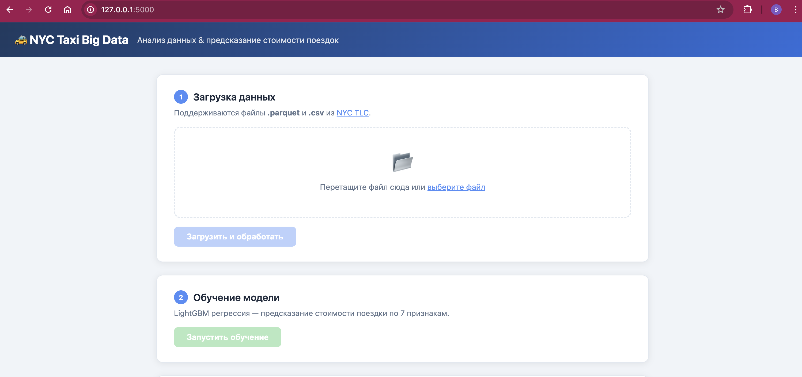
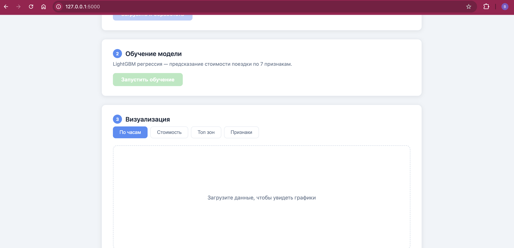

И после загрузки данных (загрузили вручную [файл](https://d37ci6vzurychx.cloudfront.net/trip-data/yellow_tripdata_2024-01.parquet) с сайта, за январь 2024):

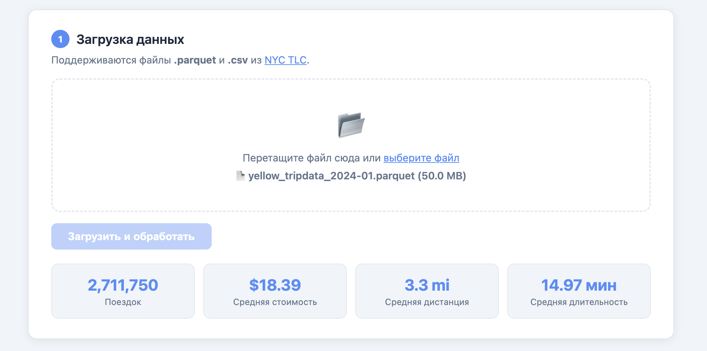

После нажатия на кнопку обучения модель обучается и отображаются метрики качества:

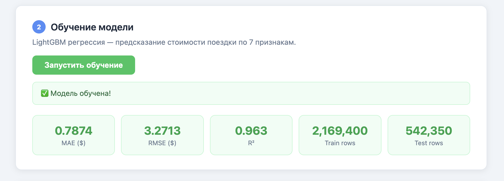

Затем доступны интерактивные графики – распределение поездок по часам суток:

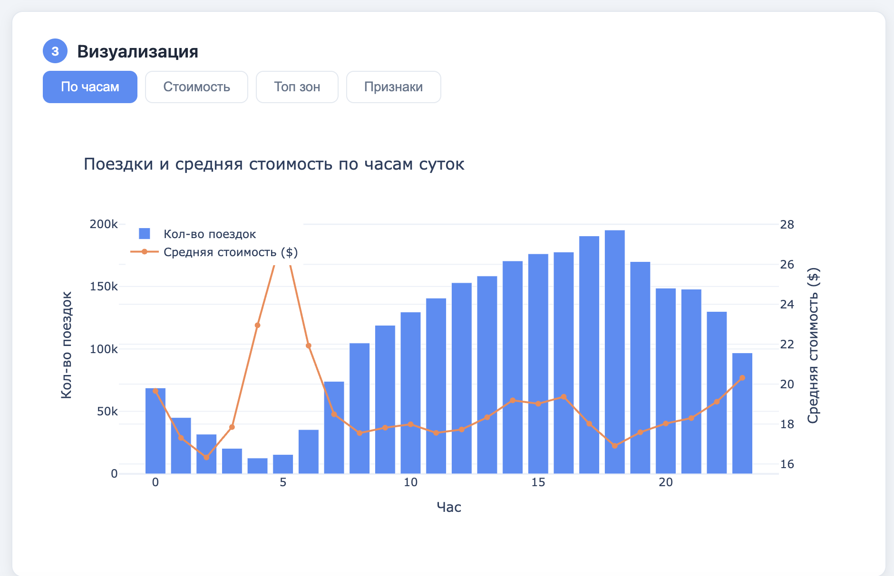

Распределение стоимости поездок:

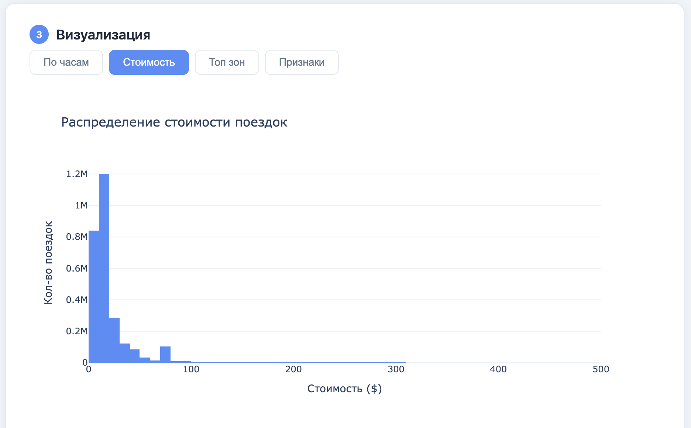

Топ-20 зон отправления:

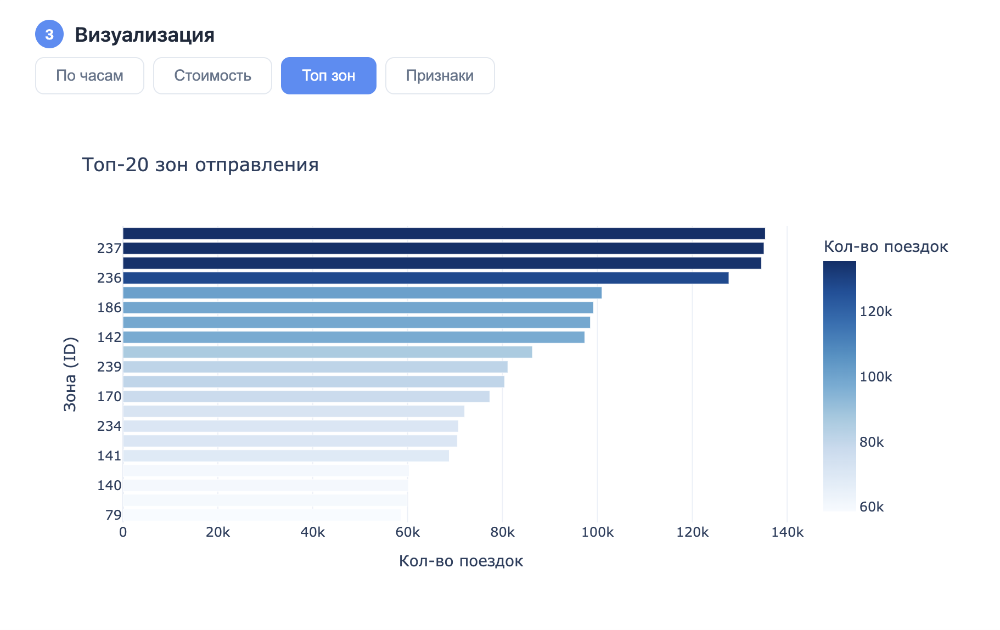

Важность признаков модели:

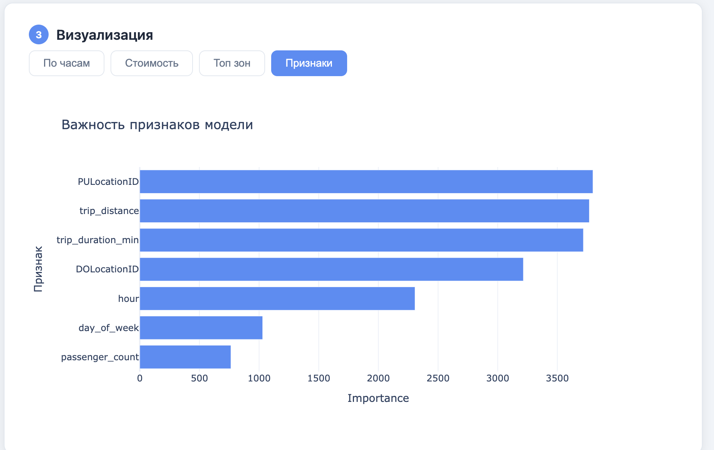

Версия содержит обучение модели, 4 интерактивных графика (без стилизации) и базовые статистики по загруженным данным. Веб-интерфейс максимально простой — Flask на бэкенде, фронтенд на HTML/CSS/JS без фреймворков.

Загрузка данных — вручную через drag-and-drop в браузере. Данные проходят предобработку:
- отбор нужных колонок (`trip_distance`, `fare_amount`, `passenger_count`, координаты зон, временны́е метки)
- парсинг дат и извлечение признаков: час отправления (`hour`), день недели (`day_of_week`), длительность поездки в минутах (`trip_duration_min`)
- фильтрация выбросов: стоимость $1–500, дистанция 0.1–100 миль, длительность 1–180 минут, 1–6 пассажиров
- удаление строк с пропущенными значениями
Предобработка реализована на Python с помощью Pandas (операции над датафреймами) и PyArrow (чтение `.parquet`-файлов).

Обучение модели запускается вручную кнопкой в интерфейсе, обрабатывается в отдельном потоке (не блокирует UI), статус периодически опрашивается с фронтенда.

Веб-сервер имеет REST API:

| Метод | URL | Описание |
|-------|-----|----------|
| `POST` | `/api/upload` | Загрузить файл, запустить предобработку |
| `POST` | `/api/train` | Запустить обучение модели в фоне |
| `GET` | `/api/status` | Статус загрузки, обучения, метрики |
| `GET` | `/api/charts/hourly` | График поездок по часам суток |
| `GET` | `/api/charts/fare_dist` | Распределение стоимости |
| `GET` | `/api/charts/top_zones` | Топ-20 зон отправления |
| `GET` | `/api/charts/feature_importance` | Важность признаков модели |

Стек этой версии:

| Компонент | Технология |
|-----------|------------|
| Веб-фреймворк | Flask 3.1 |
| Обработка данных | Pandas 2.2, PyArrow 24 |
| Машинное обучение | LightGBM 4.6, scikit-learn 1.6 |
| Сохранение модели | joblib 1.4 |
| Визуализация | Plotly 6.1 |
| Frontend | HTML/CSS/JS, Plotly.js |

### Вторая версия: добавляем трансформации данных

Далее внедряем более продвинутое хранение и обработку данных.

Что меняем:
- Берём квартал вместо одного месяца (~9.5M строк вместо ~3M)
- Скрипт автоматически скачивает 3 parquet-файла с NYC TLC по выбранному году и кварталу
- Переписываем трансформации данных на SQL через **DuckDB**
- Внедряем 3-слойную архитектуру обработки данных (medallion): каждый слой – отдельный SQL-скрипт
- Пайплайн обработки автоматически запускается после скачивания, шаги отображаются в интерфейсе в реальном времени с небольшими семплами результатов

Так выглядит скачивание квартала с прогресс-баром:

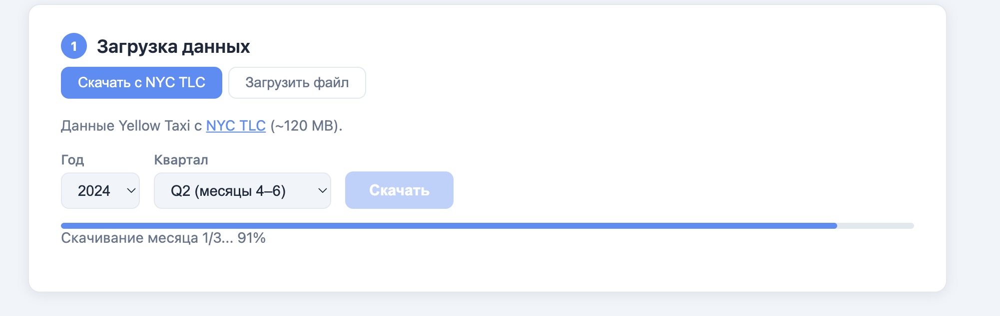

После скачивания автоматически запускается пайплайн предобработки. Обработка данных организована в 3 слоя:

**Слой 1 — RAW** (`sql/01_raw.sql`)
Данные загружаются из `.parquet`-файлов строго как есть, без изменений. Единственное добавление – служебное поле `processed_dttm` (время загрузки записи). Этот слой – неизменяемый источник правды.

**Слой 2 — CLEAN** (`sql/02_clean.sql`)
Чистка данных:
- явный каст типов (`::TIMESTAMP`, `::DOUBLE`, `::INTEGER`)
- удаление строк с `NULL` в ключевых полях
- дедупликация через `ROW_NUMBER() OVER (PARTITION BY ... ORDER BY processed_dttm)` — оставляем первую запись по каждому уникальному набору ключевых полей

**Слой 3 — FEATURES** (`sql/03_features.sql`)
Бизнес-логика и подготовка к обучению:
- фильтрация выбросов: стоимость $1–500, дистанция 0.1–100 миль, 1–6 пассажиров, длительность 1–180 минут
- извлечение признаков: `hour` (час отправления), `day_of_week` (день недели), `trip_duration_min` (длительность в минутах)

Интерфейс отображает каждый слой с образцом данных и статистикой по количеству строк:

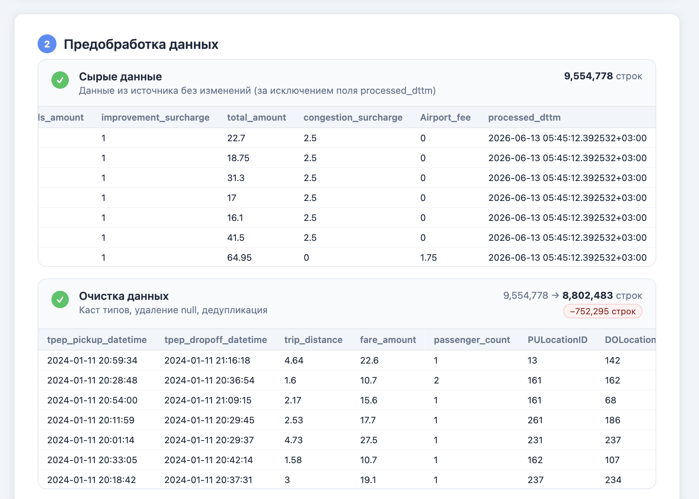

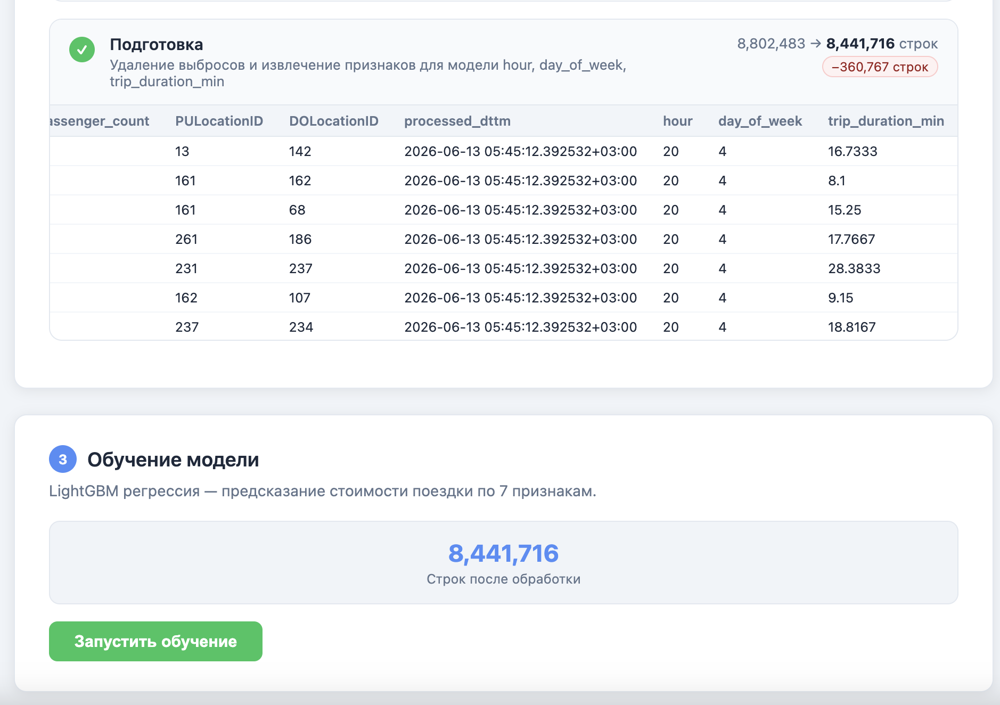

После завершения пайплайна появляется секция обучения. На квартальных данных (Q1 2024) финальный датасет содержит **8 441 716 строк** после всех фильтров. Метрики модели:

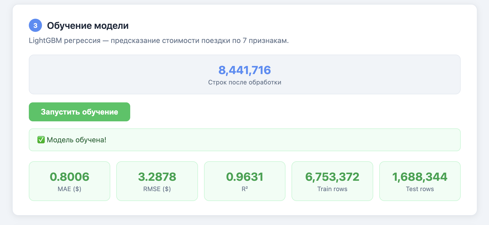

Стек второй версии:

| Компонент | Технология |
|---|---|
| Бэкенд | Flask |
| Обработка данных | DuckDB, Pandas |
| Машинное обучение | LightGBM, scikit-learn, joblib |
| Визуализация | Plotly |
| Фронтенд | HTML, CSS, JS |

## Третья версия: визуализация + работаем над внешним видом (финал)

Что меняем:
- Разносим шаги работы по отдельным вкладкам (загрузка и предобработка, обучение, визуализация), чтобы было меньше скролла
- Во вкладке "обучение" добавляем возможность предсказать стоимость своей поездки по введенным параметрам (час, день недели, дистанция), переносим данные о важности признаков сюда
- На вкладке "визуализация" строим что-то вроде бизнес-дашборда, который будет полезен в аналитике больше, чем текущие графики
- Добавляем справочник зон (сейчас только id, мы вытаскиваем их названия по id)
- Тёмная тема и много другой косметики

Финальный вид:

Загрузка данных автоматическая с выбором года и квартала, также отобразили примерный объём файла:

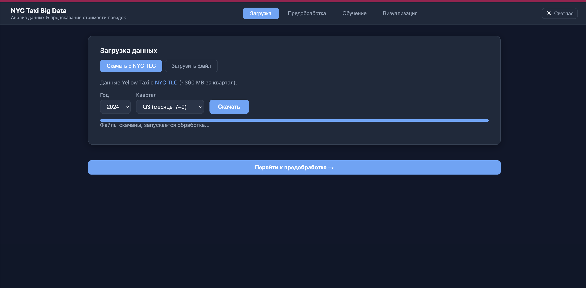

Предобработка данных в три слоя, семплы каждого из этапов обработки:

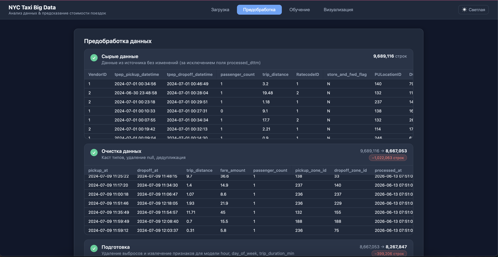

Обучение модели с метриками качества и важностью фич, а также калькулятор стоимости поездки:

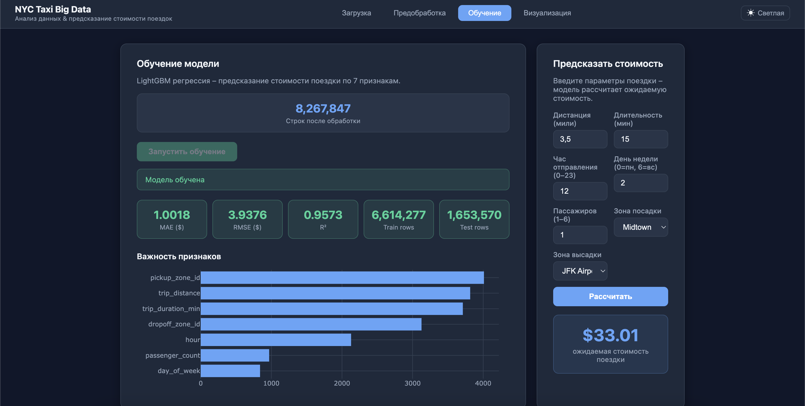

Дашборд с интерактивными графиками:

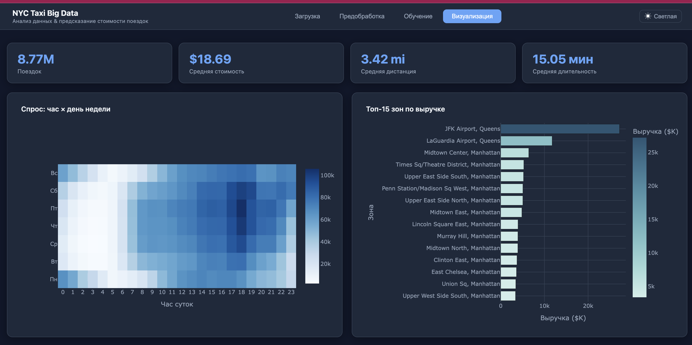
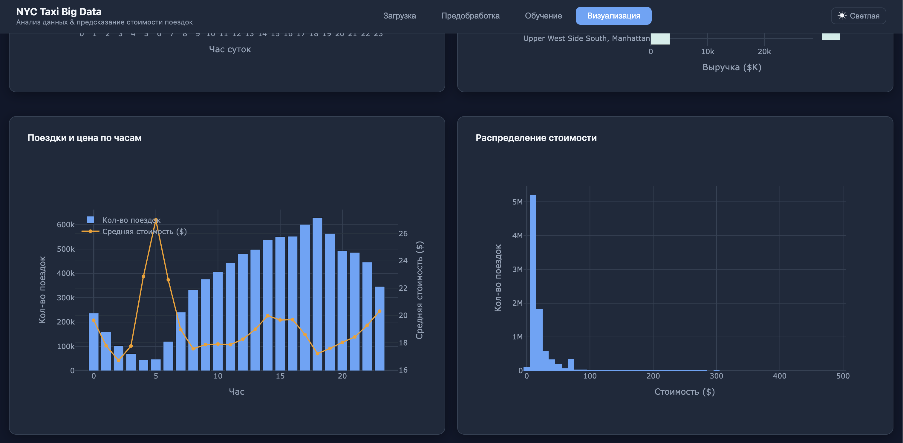

Ещё добавили справочник зон (выгрузили с сайта в формате csv, протащили в базу данных, приджойнили к данным о поездках на финальном слое обработки - для обучения бесполезно, нужно для визуализации) в скрипте `zones.py`.

Стек финальной версии: без изменений относительно второй версии.

## Итог

У нас есть веб-приложение с REST API, которое позволяет обрабатывать и анализировать данные о поездках на такси в Нью-Йорке. В функционал входит автоматическая (или ручная) загрузка данных с сайта, пайплайн трансформации данных в три слоя (на SQL через DuckDB), обучение модели LightGBM (регрессия) на основе 7 признаков (с отображением метрик качества и важности признаков), визуализация данных и калькулятор стоимости поездки на основе обученной модели.

Демо результата: 